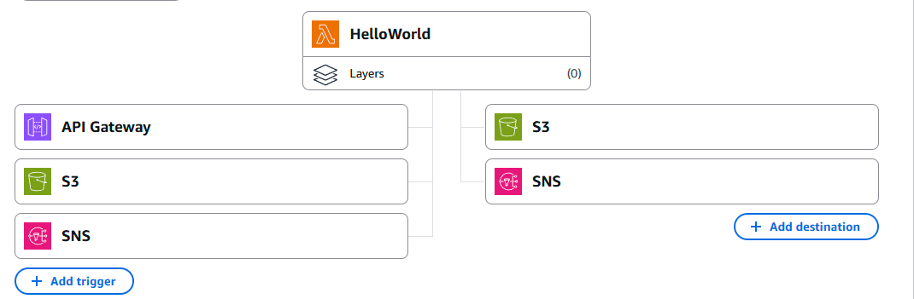

# Serverless Lambda with API Gateway, SNS, and S3

This project demonstrates a simple serverless architecture using **AWS Lambda**, integrated with **API Gateway**, **SNS**, and **S3**, to process requests and trigger notifications.

## Architecture
- **API Gateway**: Receives HTTP requests and invokes the Lambda function.  
- **Lambda Function**: Handles the request and integrates with SNS and S3.  
- **SNS Topic**: Sends email notifications when the Lambda function runs successfully.  
- **S3 Bucket**: Stores logs or invocation records when the function fails.  

## How It Works
1. A request is made to the API Gateway endpoint.  
2. The Lambda function runs and returns a `"Hello from Lambda!"` message.  
3. On success, SNS sends a notification email to the subscriber.  
4. On failure, Lambda automatically writes logs to the configured S3 bucket.  

## Setup Instructions
1. Create a Lambda function using the default Python 3.12 runtime.  
2. Attach API Gateway as a trigger (HTTP endpoint).  
3. Create an SNS topic and subscribe your email to it.  
4. Create an S3 bucket for Lambda logs.  
5. Configure:
   - SNS as a success destination  
   - S3 as a failure destination  

6. Deploy and test the function by invoking the API Gateway URL.

## Technologies Used
- AWS Lambda  
- Amazon API Gateway  
- Amazon SNS  
- Amazon S3  
- Python 3.12 (default runtime)  

## Architecture Diagram

